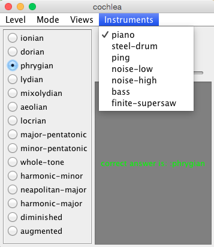

# cochlea
An ear training application. That is, a tool to play musical sounds for you and tell you when you correctly identify them.

## Usage
- OSX: Move the folder holding these files to /Applications and click on cochlea.app. For alternatives, see the cross-platform solution below.
- Cross Platform: If you have  installed, simply execute `lein run` in your shell. If you do not wish to install leiningen, you can copy the libscsynth library to a suitable system directory, e.g. /usr/local/lib on linux or mac, and then execute `java -jar cochlea.jar`. Libscsynth is will come from target/base+system+user+dev/native/{windows,macosx,linux}/x86/libscsynth.{dll,dylib,lib} for windows, macosx, and linux respectively.
Note - supercollider, the sound system, takes several seconds to boot, and you may experience a timeout upon startup. Try starting cochlea again if this happens.

- If you wish to log your performance in postgres or sqlite, edit the `:db-choice` variable in `.lein-env` to have the value `"sqlite"` or `"postgres"`, respectively. Then, run `lein run init` or `java -jar cochlea.jar initialize` to initialize the database. Note, the visualizations only work with postgres.
- Using samples requires some extra setup. Also, before adding many samples, know that each sampled instrument takes a few seconds to be prepared when cochlea is starting up, and that loading too many instruments can overwhelm and crash supercollider (not causing any permanent problems, just this is a sign to use fewer sampled instruments). One to four is the recommended amount of sampled instruments.

If there are any questions, contact me at seewalker.120@gmail.com. Pull requests are welcome.
## Appearance

When you are training on chords, at the ':extended' difficulty, and you make a correct guess.

When you are training on chords, at the ':select' difficulty, and you make an incorrect guess.

When you are training on scales, at the ':extended' difficulty, and you make a correct guess, and you click on the dropdown menu to select an instrument.

The history window.

A plot of proportion of correct answers over sessions.

## Features

- You can practice recognizing scales, intervals, or chords.
- Three distinct difficulty levels for each mode of play.
- A variety of instruments that the sounds can be played with, some of which are provided by supercollider, some of which are textually defined in this project, and some of which are sampled instruments based on the London Philhmarmonic orchestra and made available to clojure through .
- Visual feedback for correct and incorrect answers.
- If you have access to postgres, cochlea will store your performance and can display various visualizations of your performance over time. This sense of time is measured through timestamps and a session identifier which gets incremented whenever cochlea is started up.
- An interface for writing arbitrary SQL queries on the performance log within the app, if you'd like.
- Various and easy configurations.

## Configurable Parameters

The various knobs you might want to turn without altering the source code are in the '.lein-env' file. This file contains a clojure datastructure, but if that doesn't mean anything to you, that's okay! Changing a value from 'true' to 'false' or '2' to '8' will probably do what you expect, and if not let me know.

This is an exhaustive list of configurable parameters:

- `:default-difficulty` - indicates difficulty level to start with; possible values are :select, :extended, :all.
- `:default-mode` :scales - possible values are :scales, :intervals, and :chords.
- `:autoplay` - specifies whether the next sound will be played right after making your guess to the previously played sound. You may want to set this to 'true' to avoid the nuissance of explicitly asking for the next sound, but you may want to set this to false if you find that the association between clicking and hearing makes you wrongly associate the previous sounds' word with the current sound.
- `:threshold` - if a session has fewer than this many guesses, exclude it from queries which operate on sessions.
- `:tempo` - The tempo that scales will be played at.
- `:pitch` - The root note involved in the chords and scales.
- `:simultaneous-intervals` - If true, practicing with intervals will have the two notes play simultaneously. Otherwise, they are sequenced.
- `:allow-inversions` - If and only if true, practicing with chords will involve random inversions.
- `db-choice` - Can have value "postgres", "sqlite", or "" (for no database).
- `:db-host` - a string representing the address of the host the database system is running on, if you are using a multi-process database (with current implementation, that means postgres). Probably localhost but maybe some remote IP address if you'd like to store your history elsewhere.
- `:db-choice` - a boolean value specifying whether cochlea will attempt to use postgres for storage.
- `:pg-data-dir`  - postgres' notion of data directory should be indicated here, if you are using postgres.
- `:db-user` - the username that owns the postgres database.
- `:pg-user-password` - if your postgres environment does not require login, you may be able to leave this blank. note, the empty string "" indicates no password provided; do not delete the double quotes for that purpose.

## Keyboard Shortcuts

- typing 'n' in the main window will, just like the 'next' button, play the next sound and not store anything about your response to the current sound.
- typing 'r' in the main window will, just like the 'replay' button, again play the sound you are currently trying to guess, without doing any storage.
- typing 'h' in the main window will make the history window pop up.
- typing 'control F' in the main window will toggle full screen.
- typing 'v' in the history window will initiate the visualization.

## What Gets Stored?

If using postgres, this is the schema:

A sequence should exist for each user, and have a name like 'session\_yourName'
If using sqlite, the schema is the same, except with varchars instead of the enum type. The database gets stored in `cochlea_sqlite.db`.

## Procedure For Adding Sampled Instruments
- Add an entry to the 'require' list in the instruments.clj namespace which is similar to the existing ones.
- Add another entry to the 'sampled-insts' map where the key is the instrument you 'refered' in the previous step and where the value is the what the cochlea GUI should call it.
- Add a var to instruments.clj whose name is the same as what you called the instrument, except now it's a symbol rather than a string. Something like `(def cello cello-inst)` if you added `cello-inst "cello"` to the sampled-insts map in the previous step.

If any of that language is not clear to you, just try following the pattern of what is happening with the mandolin.

## Underlying Technologies

- GUI - seesaw.
- Music - overtone.
- Storage - postgres/sqlite.
- Plotting - incanter.

## Hacking
This project tries to be extensible by taking the code-is-data philosophy of clojure seriously. Here are some bits of code that you can straightforwardly change that you might want to:

- The `choices` map in sounds.clj controls which difficulty levels exist and what sounds are members of those difficulty levels. Adding, removing, or modifying a level here will not break the GUI, because the GUI works by observing this data structure.
- The `queries` map in past.clj defines certain queries and what their visualizations mean, along with their presence in the `queries` map indicating that it should show up in the relevant dropdown menu.
- You can create new instruments in instruments.clj, and if you add them to the `instruments` vector, they will be available to the app. The textual specification of instruments is overtone code.
- This is probably something you don't need to worry about. If you use cochlea via the jar rather than via `lein run` and you want to see the effects of your edits, you can run `make_jar.sh`. It is a weird hack workaround (which requires leiningen, by the way, so it is easiest just to use `lein run`); do not be surprised to see a warning about the main class not being included. You can expect overtone to load incorrectly right after the 'compiling cochlea.core' message, and at this point you interrupt it with control-c. This process will end up with a runable jar called `cochlea.jar` at the end.

## Issues / Things To Come
- The visualizations only work with postgres.
- The intervals mode sometimes leads to choices outside the expected range. Not sure why.

## License
GPL v3 (http://www.gnu.org/copyleft/gpl.html)
